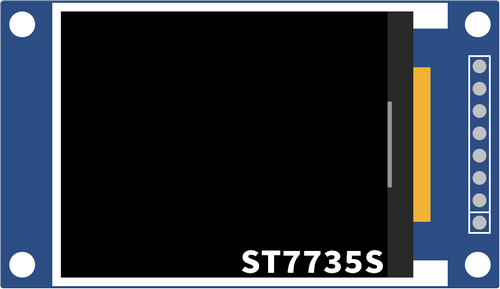

# [Sitronix ST7735S](http://www.sitronix.com.tw/en/product/Driver/mobile_display.html)

## Parameters
* **Display size:** 1,8 [inch]
* **Resolution:** 128 x 160 [px]
* **Colors:** 262144
* **Driver:** [ST7735S](documentation/datasheet/st7735s-datasheet-v1.4.pdf)
* **Protocol:** SPI
* **Logic:** 3,3V

Some display modules have a built-in 3,3V voltage regulator on VCC line.
Be careful with the rest of lines.

## Pins
| Pin | Name | Description |
| :---: | :---: | --- |
| 1 | VCC | Power Supply |
| 2 | GND | Power Ground |
| 3 | CS | [SPI] Chip Select |
| 4 | RESET | Reset |
| 5 | A0 | Data/Command Switch |
| 6 | SDA | [SPI] Master Output Slave Input |
| 7 | SCK | [SPI] Serial Clock |
| 8 | LED | Backlight |

## Documentation
Go to [documentation](documentation/readme.md).

## Reporting issues
Please feel free to report issues.

## License
This software is licensed under the MIT License. See the [license file](license.txt) for details.
